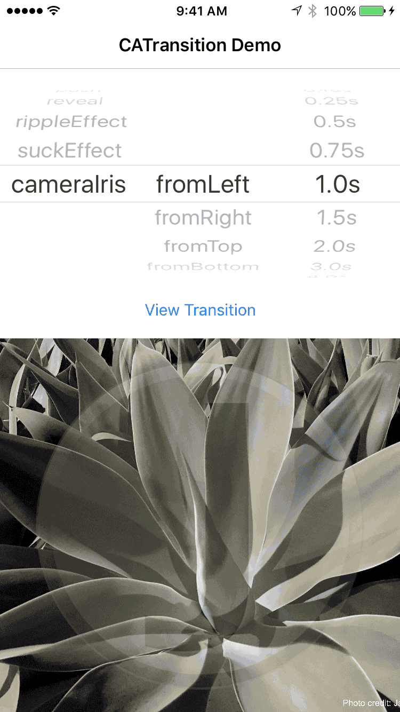

#CATransition Demonstration

##Demonstrations

##Types (type of animation)
Although there are many CATransition Types, developers should only use the public ones, as using a private API in your app may lead it it being rejected from the App Store.
* cube
* fade
* moveIn
* oglFlip
* pageCurl
* pageUnCurl
* push
* reveal
* rippleEffect
* suckEffect

##Subtypes (direction of animation)
Not all types have a direction. As one can see from the above demonstrations, subtype directions make no changes to the transitions such as "fade."  
* fromLeft
* fromRight
* fromTop
* fromBottom

##How to use CATransition
You can either enter the types as constants, or use the String values that I have listed above.